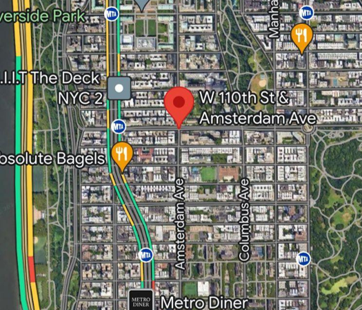
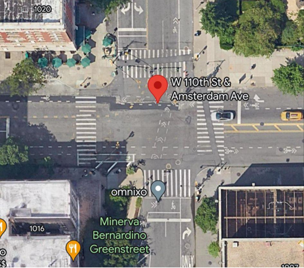



Final Report

CIEN E4011 Big Data in Transportation

Instructor : Sharon Di

Chen Liu

Peggy Luo

Suyu Luohong

Guanting She

Grant Zhou

# **1.Problem Statement**

This document constitutes the final report for the Big Data in Transportation course, centering on the analysis of traffic patterns at designated intersections and exploring safety concerns for elderly pedestrians through surveys. The subsequent sections provide a summary of responses and identified patterns. Our virtual analysis location is at the intersection of Amsterdam Avenue and West 110th Street. The location and bird's eye view of the intersection are depicted in Figures 1 and 2, respectively. Additionally, the questionnaire interviews will be conducted at the nearby subway station, specifically the southeast exit of the Cathedral Pathway station.

                   
Figure 1. Intersection Location on Google   

Figure 2. Bird View of Intersection

Our hyposisthes is that the current public transportation system and intersection design are not sufficiently accommodating for elderly individuals, particularly those who require walking aids. Additionally, we believe that the road planning at our experimental site is not entirely reasonable, with instruction signs that are not optimally visible and easy to understand. This investigation is divided into two main components: the intersection field experiment and the in-person questionnaire. In the field experiment, our goal is to collect data and identify both existing and potential traffic issues within the experimental field, including but not limited to road planning, implementation of instruction signs, and the availability of infrastructures.
# **2. Data Description**

We are collecting the traffic data at the intersection of Amsterdam Avenue and West 110th Street on Wednesday, April 24th, starting from 5:25 pm. Five group members were divided into two subgroups, one with two members and the other with three. They were tasked with recording real-time traffic, counting pedestrians, and monitoring car flows at the northwestern and southwestern corners of the intersection, respectively. The data collected from all directions are summarized in Appendix 7.1 with Tables 1, 2, and 3 recording the counting of vehicles, bikes and pedestrians within one hour with a 5 minute interval. Currently, we face challenges due to the lack of high-resolution cameras, which complicates the accurate recording of pedestrians over the age of 65. To clearly illustrate the traffic direction planning at this intersection, Figure 3 provides a detailed view of the traffic flow design.

Figure 3. Traffic Design Sketch

`	`The ten questionnaire responses are attached in the Appendix 7.2. The survey was conducted in the 110 Subway, targeting individuals aged 65 and older. The questionnaire and its corresponding responses are summarized below in Figure 4. Sixteen groups of elderly participants were approached, with only ten agreeing to participate in the survey and providing meaningful responses. Visualization and analysis for both data are discussed in the next section.

**3.0 Data Visualization and Interpretation**

3\.1 Intersection Traffic Visualization and Analysis

Figure 4

`	`Figure 4 shows the number of vehicles traversing the experimental field, revealing a discernible pattern where vehicle flow varies significantly between directions. It can be seen that generally fewer vehicles are coming from East and West than coming from South and North, especially it can be observed that there are a large number of vehicles coming from South. This phenomenon is expected due to the city planning of Manhattan Island, where the main traffic flow is across the south-north direction. Considering the time of the experiment, the reason for having extremely large traffic flow from south to north direction is the weekday traffic shoulder season, when most people come back from work at 5 p.m. since most workspaces and businesses are located in southern Manhattan. 

Figure 5

Figure 5 depicts a histogram of bicycle traffic, similar to Figure 4, showcasing the flow in different directions across various time segments. From a directional perspective, the flow from south to north (S-N) is significantly higher than other directions, with an average of about 15 bicycles per hour in all other directions compared to 69 bicycles per hour in the S-N direction. Temporarily, the flow in each direction generally increases over time, with traffic intensifying closer to 6 PM. The greater flow in the S-N direction is likely due to the dense residential areas uptown from this intersection, correlating with peak times for returning home after work and school. Additionally, some of the bicycle traffic may be attributed to food deliveries around dinner time at 6 PM, which also contributes to the increased bicycle flow at this hour. Overall, both in terms of time and direction, the trends in bicycle traffic are similar to those observed in vehicular traffic. This similarity also elucidates the distinct purposiveness of the traffic flow characteristics at this intersection, where both vehicles and bicycles exhibit identical patterns of flow. These characteristics are independent of the mode of transportation used but are more closely associated with the purpose of the travel.

Figure 6

Figure 7

This graph is a histogram showing pedestrian flows, representing the number of pedestrians in different directions. Similar to the previous Figure x. Vehicle Histogram, it includes the number of pedestrians traveling from the north, south, east, and west directions to the other directions, denoted by N-S, N-E, etc. The vertical axis ranges from 0 to 35, and each bar represents the number of pedestrians in a particular time period, and each bar represents the pedestrian counts for a specific time period, spanning the same time as the vehicular charts, from 5:00 a.m. to 6:00 a.m., in five-minute intervals. The color of the bars represents different time periods, starting from 5:00 to 5:05 (dark blue) and ending at 5:55 to 6:00 (dark green), for a total of 13 time periods. By comparing the heights of the bars for each time period, we can see that pedestrian traffic is particularly high in certain directions during the time periods 5:10-5:15 (magenta) and 5:50-5:55 (light purple). Among the possible factors for the higher pedestrian flows in N-S and S-N are the nearby campus dismissal and the predominantly residential neighborhoods surrounding the study area, which are related to the factor of people returning home from work and school; and the presence of the 110th Street subway station nearby, where the higher flows in E-W relative to W-E may be related to people's transportation trips to the 110th Street subway station. In summary, this map shows a positive correlation between the pedestrian flow map primarily with the evening peak after work and school and nearby subway traffic trips.

# 3.2 Questionnaire Visualization and Analysis

Note: Question 10 is an open-ended question. The occupancy percentages in the pie chart reflect the frequency with which these responses were mentioned by the elderly pedestrians.

Figure 7. Pie Chart of Questionnaire Responses

The primary focus of the questionnaire was on assessing the accessibility of subway services for elderly users. This included the ease of entering and exiting subway stations, the process of purchasing tickets, and the clarity of subway navigation. Based on the responses received, it appears that the current subway facilities do not meet expectations. For the elderly, accessibility and feasibility of public transport are crucial, particularly in New York City, where driving can be challenging due to heavy traffic and their health conditions. Furthermore, a significant issue identified is the lack of working elevators at many smaller stations, with half of the respondents expressing concerns about their ability to climb stairs without assistance. Additionally, some elderly individuals highlighted difficulties accessing the boarding area through standard turnstiles when using walking aids or mobility scooters. It was also noted that some emergency exits only permit exiting, which restricts entry for those needing easier access. 

Cleanliness emerged as a significant concern from the survey responses, with many elderly participants highlighting issues related to odors and general dirtiness in the subway. One interviewee remarked, "I have to wear masks sometimes because of the smell, but I have an asthma issue so I don't like it." This statement illustrates the dilemma faced by those with health conditions when confronted with unpleasant subway environments. The lack of cleanliness at subway stations significantly affects the overall experience for all passengers, not just the elderly, underscoring the need for improved maintenance and sanitation measures.

Responses to the open-ended question revealed high expectations among elderly subway users for improved accessibility features, such as elevators and automatic doors. Some respondents also expressed a desire for more benches at subway stations. Additionally, there were concerns about the current subway information displays, including screens that show waiting times and exit notification signs, which are not sufficiently tailored to the needs of older users. The respondents suggested enhancements such as clearer audio announcements and larger, more readable fonts on screens. There is also a call for more explicit directional signage, especially for those who may have limited access to online support tools like Google Maps. This feedback underscores the need for subway systems to be more considerate of the challenges faced by elderly passengers.

**4.0. Policy Making and Validation**

`	`According to the data analyzed in previous sessions, we made following suggestions to traffic policies at the experimental area, including crosswalk and subway station. 

`	`Regarding the experimental crosswalk (Amsterdam Avenue and West 110th Street), it is preferred to increase the capacity of North-south traffic flow. According to the data collected, it can be observed that there is a massive flow of traffic in the North-south direction, while there is only one-way two-lane road which directly caused traffic congestion at the crossroad during experimental time. As increasing vehicle lanes is not practical, we suggest there can be changes in traffic light intervals. Aside from the massive traffic flow in north-south direction, we can also observe small traffic flow in east-west direction. Therefore, we suggest increasing the time interval and/or green light frequency for north-south direction while shortening and decreasing the same for east-west direction. This should solve the traffic congestion in this specific field efficiently. 

`	`Secondly regarding the subway station at 110th and Broadway, our suggestions for improvement would be adding more availability support. A large portion of the interviewed elders responded as “lack of support” and “unclear instructions signs”. In fact, this interaction is surrounded by three supermarkets, five restaurants, two mobile service centers, and two banks. It is apparently a popular place for people. As a contract, the subway station is rather small and insufficient on facilities, where there are no officers nor MTA staff at the station. We have witnessed an elderly lady unable to purchase a ticket with several attempts. Regarding to facilities required, multiple interviewees had responded that they want elevators or escalators. Apparently, walking up and down stairs are an important problem for elders, who usually spend few minutes just to walk down the stair at the station. Beside the mobility aiding facilities, the instructions at the station and within the subway are also described as “unclear” by large portion of the interviewees. Corresponding suggestions would be implementing more visible digital instructions signs, including facilities outside the corresponding exit etc., and also implementing more vocal instructions, such as more clear and audible broadcasting system. 

**5.0 Conclusion and Potential Future Work**

The current survey and traffic analysis focused on the experiences of the elderly indicate a generally negative response. Public transportation, such as subways, reveals several design issues that are unsuitable for older individuals. There are significant complaints regarding basic accessibility services like elevators and automatic doors. Traffic itself appears to have minimal impact on the elderly, according to observations. However, to enhance the comprehensiveness and accuracy of our investigation, several steps are necessary.

First, we should extend the duration of live traffic monitoring to develop a more comprehensive database. Second, we need higher resolution cameras to better capture pedestrian flow, which will help verify manual counting data. Third, the questionnaire should be made shorter and clearer, as the current longer format leads to disinterest during the interviewing process.

**6.0 Contribution Table**

|**Traffic Recording and Questionnaire** ||||||
| :- | :- | :- | :- | :- | :- |
||Chen Liu|Peggy Luo|Suyu Luohong|Guanting She|Grant Zhou|
|Traffic Recording||✔|✔|||
|Traffic Counting|✔||✔|✔|✔|
|Questionnaire Makeup |✔|✔|✔|✔|✔|
|Questionnaire Interviewing|✔|✔|✔|✔|✔|
|**Report**||||||
|Problem Statement|✔|✔||||
|Data description|✔|✔||||
|Data Visualization||✔|||✔|
|Python Analysis|||||✔|
|Data Analysis|✔|✔|✔|✔|✔|
|Policy making and Validation|✔|||||
|Conclusion and Potential Future Work||✔||||

**7.0 Appendix** 

7\.1 Vehicle, Bike and Pedestrian Counting Tables

Table 1. Vehicle Count via all Direction

<table><tr><th colspan="6" valign="top"><b>Vehicle</b></th></tr>
<tr><td valign="top"><b>Direction</b> </td><td valign="top"><b>5:00-5:05</b></td><td valign="top"><b>5:05-5:10</b></td><td valign="top"><b>5:10-5:15</b></td><td valign="top"><b>5:20-5:25</b></td><td valign="top"><b>5:25-5:30</b></td></tr>
<tr><td valign="top"><b>N-S</b></td><td valign="top">0</td><td valign="top">0</td><td valign="top">0</td><td valign="top">0</td><td valign="top">0</td></tr>
<tr><td valign="top"><b>N-E</b></td><td valign="top">5</td><td valign="top">7</td><td valign="top">4</td><td valign="top">8</td><td valign="top">6</td></tr>
<tr><td valign="top"><b>N-W</b></td><td valign="top">6</td><td valign="top">6</td><td valign="top">5</td><td valign="top">5</td><td valign="top">9</td></tr>
<tr><td valign="top"><b>S-N</b></td><td valign="top">28</td><td valign="top">50</td><td valign="top">31</td><td valign="top">41</td><td valign="top">37</td></tr>
<tr><td valign="top"><b>S-E</b></td><td valign="top">9</td><td valign="top">17</td><td valign="top">7</td><td valign="top">15</td><td valign="top">2</td></tr>
<tr><td valign="top"><b>S-W</b></td><td valign="top">0</td><td valign="top">1</td><td valign="top">3</td><td valign="top">4</td><td valign="top">6</td></tr>
<tr><td valign="top"><b>E-N</b></td><td valign="top">5</td><td valign="top">4</td><td valign="top">6</td><td valign="top">1</td><td valign="top">0</td></tr>
<tr><td valign="top"><b>E-S</b></td><td valign="top">0</td><td valign="top">0</td><td valign="top">0</td><td valign="top">0</td><td valign="top">0</td></tr>
<tr><td valign="top"><b>E-W</b></td><td valign="top">9</td><td valign="top">13</td><td valign="top">18</td><td valign="top">12</td><td valign="top">23</td></tr>
<tr><td valign="top"><b>W-N</b></td><td valign="top">4</td><td valign="top">8</td><td valign="top">5</td><td valign="top">9</td><td valign="top">11</td></tr>
<tr><td valign="top"><b>W-E</b></td><td valign="top">7</td><td valign="top">6</td><td valign="top">6</td><td valign="top">6</td><td valign="top">4</td></tr>
<tr><td valign="top"><b>W-S</b></td><td valign="top">0</td><td valign="top">0</td><td valign="top">0</td><td valign="top">0</td><td valign="top">0</td></tr>
<tr><td valign="top"></td><td valign="top"><b>5:30-5:35</b></td><td valign="top"><b>5:35-5:40</b></td><td valign="top"><b>5:40-5:45</b></td><td valign="top"><b>5:50-5:55</b></td><td valign="top"><b>5:55-6:00</b></td></tr>
<tr><td valign="top"><b>N-S</b></td><td valign="top">0</td><td valign="top">0</td><td valign="top">0</td><td valign="top">0</td><td valign="top">0</td></tr>
<tr><td valign="top"><b>N-E</b></td><td valign="top">8</td><td valign="top">4</td><td valign="top">3</td><td valign="top">6</td><td valign="top">6</td></tr>
<tr><td valign="top"><b>N-W</b></td><td valign="top">4</td><td valign="top">2</td><td valign="top">2</td><td valign="top">6</td><td valign="top">6</td></tr>
<tr><td valign="top"><b>S-N</b></td><td valign="top">41</td><td valign="top">42</td><td valign="top">29</td><td valign="top">26</td><td valign="top">54</td></tr>
<tr><td valign="top"><b>S-E</b></td><td valign="top">5</td><td valign="top">15</td><td valign="top">12</td><td valign="top">11</td><td valign="top">14</td></tr>
<tr><td valign="top"><b>S-W</b></td><td valign="top">1</td><td valign="top">5</td><td valign="top">2</td><td valign="top">2</td><td valign="top">3</td></tr>
<tr><td valign="top"><b>E-N</b></td><td valign="top">8</td><td valign="top">3</td><td valign="top">7</td><td valign="top">3</td><td valign="top">4</td></tr>
<tr><td valign="top"><b>E-S</b></td><td valign="top">0</td><td valign="top">0</td><td valign="top">0</td><td valign="top">0</td><td valign="top">0</td></tr>
<tr><td valign="top"><b>E-W</b></td><td valign="top">17</td><td valign="top">6</td><td valign="top">14</td><td valign="top">8</td><td valign="top">10</td></tr>
<tr><td valign="top"><b>W-N</b></td><td valign="top">9</td><td valign="top">11</td><td valign="top">13</td><td valign="top">14</td><td valign="top">16</td></tr>
<tr><td valign="top"><b>W-E</b></td><td valign="top">8</td><td valign="top">4</td><td valign="top">9</td><td valign="top">12</td><td valign="top">8</td></tr>
<tr><td valign="top"><b>W-S</b></td><td valign="top">0</td><td valign="top">0</td><td valign="top">0</td><td valign="top">0</td><td valign="top">0</td></tr>
<tr><td valign="top"></td><td valign="top"><b>5:50-5:55</b></td><td valign="top"><b>5:55-6:00</b></td><td colspan="3" rowspan="13" valign="top"></td></tr>
<tr><td valign="top"><b>N-S</b></td><td valign="top">0</td><td valign="top">0</td></tr>
<tr><td valign="top"><b>N-E</b></td><td valign="top">4</td><td valign="top">6</td></tr>
<tr><td valign="top"><b>N-W</b></td><td valign="top">7</td><td valign="top">6</td></tr>
<tr><td valign="top"><b>S-N</b></td><td valign="top">26</td><td valign="top">41</td></tr>
<tr><td valign="top"><b>S-E</b></td><td valign="top">4</td><td valign="top">14</td></tr>
<tr><td valign="top"><b>S-W</b></td><td valign="top">2</td><td valign="top">3</td></tr>
<tr><td valign="top"><b>E-N</b></td><td valign="top">3</td><td valign="top">7</td></tr>
<tr><td valign="top"><b>E-S</b></td><td valign="top">0</td><td valign="top">0</td></tr>
<tr><td valign="top"><b>E-W</b></td><td valign="top">13</td><td valign="top">8</td></tr>
<tr><td valign="top"><b>W-N</b></td><td valign="top">7</td><td valign="top">9</td></tr>
<tr><td valign="top"><b>W-E</b></td><td valign="top">17</td><td valign="top">21</td></tr>
<tr><td valign="top"><b>W-S</b></td><td valign="top">0</td><td valign="top">0</td></tr>
</table>

Table 2. Bike Count via all Direction

|**Bike**||||||
| :- | :- | :- | :- | :- | :- |
|**Direction** |**5:00-5:05**|**5:05-5:10**|**5:10-5:15**|**5:20-5:25**|**5:25-5:30**|
|**N-S**|2|1|1|1|0|
|**N-E**|2|1|4|1|0|
|**N-W**|0|1|0|0|0|
|**S-N**|2|3|7|6|9|
|**S-E**|1|1|4|3|2|
|**S-W**|1|2|1|0|1|
|**E-N**|1|0|2|3|0|
|**E-S**|1|0|0|1|2|
|**E-W**|0|1|3|0|2|
|**W-N**|0|0|2|1|2|
|**W-E**|3|2|1|0|1|
|**W-S**|0|0|0|0|0|
||**5:30-5:35**|**5:35-5:40**|**5:40-5:45**|**5:50-5:55**|**5:55-6:00**|
|**N-S**|2|1|3|1|1|
|**N-E**|1|0|2|0|1|
|**N-W**|0|0|0|0|2|
|**S-N**|3|4|5|5|11|
|**S-E**|3|4|0|0|3|
|**S-W**|1|2|0|3|2|
|**E-N**|0|1|1|0|0|
|**E-S**|0|2|1|3|2|
|**E-W**|4|0|1|2|3|
|**W-N**|0|1|1|2|2|
|**W-E**|3|2|1|2|1|
|**W-S**|0|0|0|0|0|
||**5:50-5:55**|**5:55-6:00**||||
|**N-S**|0|2||||
|**N-E**|2|0||||
|**N-W**|0|2||||
|**S-N**|5|9||||
|**S-E**|1|3||||
|**S-W**|1|0||||
|**E-N**|1|2||||
|**E-S**|0|3||||
|**E-W**|0|2||||
|**W-N**|1|2||||
|**W-E**|3|3||||
|**W-S**|0|0||||

Table 3. Pedestrian Count via all Direction

|**Pedestrian**||||||
| :- | :- | :- | :- | :- | :- |
|**Direction** |**5:00-5:05**|**5:05-5:10**|**5:10-5:15**|**5:20-5:25**|**5:25-5:30**|
|**N-S**|29|28|20|30|25|
|**N-E**|0|0|0|0|0|
|**N-W**|0|0|0|0|0|
|**S-N**|29|20|24|24|27|
|**S-E**|3|1|5|4|2|
|**S-W**|0|0|0|0|0|
|**E-N**|0|0|0|0|0|
|**E-S**|0|0|0|0|0|
|**E-W**|0|0|0|0|0|
|**W-N**|0|0|0|0|0|
|**W-E**|10|16|11|5|11|
|**W-S**|0|0|0|0|0|
||**5:30-5:35**|**5:35-5:40**|**5:40-5:45**|**5:50-5:55**|**5:55-6:00**|
|**N-S**|29|25|23|22|18|
|**N-E**|0|0|0|0|0|
|**N-W**|0|0|0|0|0|
|**S-N**|30|20|23|13|20|
|**S-E**|0|0|0|0|0|
|**S-W**|0|0|0|0|0|
|**E-N**|0|0|0|0|0|
|**E-S**|0|0|0|0|0|
|**E-W**|23|19|13|31|27|
|**W-N**|0|0|0|0|0|
|**W-E**|13|15|15|22|12|
|**W-S**|0|0|0|0|0|
||**5:50-5:55**|**5:55-6:00**||||
|**N-S**|23|20||||
|**N-E**|0|0||||
|**N-W**|0|0||||
|**S-N**|22|18||||
|**S-E**|0|0||||
|**S-W**|0|0||||
|**E-N**|0|0||||
|**E-S**|0|0||||
|**E-W**|27|16||||
|**W-N**|0|0||||
|**W-E**|8|10||||
|**W-S**|0|0||||

Table 4. Senior Pedestrian Count via all Direction

|**Pedestrian**||||||
| :- | :- | :- | :- | :- | :- |
|**Direction** |**5:00-5:05**|**5:05-5:10**|**5:10-5:15**|**5:20-5:25**|**5:25-5:30**|
|**N-S**|5|7|3|8|6|
|**N-E**|0|0|0|0|0|
|**N-W**|0|0|0|0|0|
|**S-N**|8|8|5|10|2|
|**S-E**|0|0|0|0|0|
|**S-W**|0|0|0|0|0|
|**E-N**|0|0|0|0|0|
|**E-S**|0|0|0|0|0|
|**E-W**|7|5|6|0|7|
|**W-N**|0|0|0|0|0|
|**W-E**|6|9|1|0|6|
|**W-S**|0|0|0|0|0|
||**5:30-5:35**|**5:35-5:40**|**5:40-5:45**|**5:50-5:55**|**5:55-6:00**|
|**N-S**|10|2|6|9|7|
|**N-E**|0|0|0|0|0|
|**N-W**|0|0|0|0|0|
|**S-N**|4|3|5|1|10|
|**S-E**|0|0|0|0|0|
|**S-W**|0|0|0|0|0|
|**E-N**|0|0|0|0|0|
|**E-S**|0|0|0|0|0|
|**E-W**|2|5|1|1|6|
|**W-N**|0|0|0|0|0|
|**W-E**|7|2|4|11|9|
|**W-S**|0|0|0|0|0|
||**5:50-5:55**|**5:55-6:00**||||
|**N-S**|3|5||||
|**N-E**|0|0||||
|**N-W**|0|0||||
|**S-N**|8|6||||
|**S-E**|0|0||||
|**S-W**|0|0||||
|**E-N**|0|0||||
|**E-S**|0|0||||
|**E-W**|7|8||||
|**W-N**|0|0||||
|**W-E**|5|3||||
|**W-S**|0|0||||

